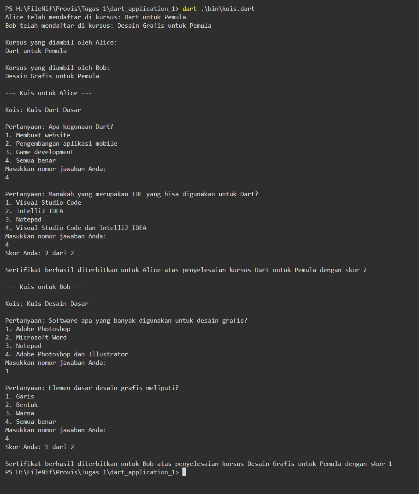

# Aplikasi Pembelajaran Online Dart

Aplikasi Pembelajaran Online ini adalah contoh implementasi konsep OOP (Object-Oriented Programming) dan pemrograman asinkronus menggunakan bahasa pemrograman Dart. Aplikasi ini dirancang untuk menunjukkan bagaimana Dart dapat digunakan untuk membangun struktur aplikasi yang kompleks dengan memanfaatkan kelas-kelas dan objek-objek.

## Fitur

Aplikasi ini mencakup beberapa fitur utama:

- **Kategori Kursus**: Memungkinkan pengelompokan kursus berdasarkan kategori.
- **Kursus**: Menyediakan informasi tentang kursus, termasuk judul, deskripsi, kreator, dan pelajaran yang tersedia.
- **Pelajaran**: Detail tentang materi pembelajaran dalam kursus.
- **Kuis**: Mengevaluasi pemahaman pengguna terhadap materi dengan serangkaian pertanyaan.
- **Pengguna**: Mendaftar pengguna dan mengelola kursus yang diambil.
- **Sertifikat**: Menerbitkan sertifikat berdasarkan pencapaian pengguna.

## Implementasi OOP

OOP diimplementasikan melalui pembuatan kelas-kelas seperti `Kursus`, `Pelajaran`, `Kuis`, `Pertanyaan`, `Pengguna`, dan `Sertifikat`. Setiap kelas memiliki atribut dan metode yang mendefinisikan dan mengelola perilaku objeknya.

### Kategori dan Kursus

Kursus dikategorikan untuk memudahkan pengelolaan. Setiap kursus terkait dengan kategori tertentu dan mencakup serangkaian pelajaran serta kuis untuk evaluasi.

### Pengguna dan Interaksi

Pengguna dapat mendaftar di kursus yang tersedia. Mereka dapat menjalankan kuis yang terkait dengan kursus dan menerima sertifikat berdasarkan hasil kuis.

## Implementasi Asinkronus

Aspek asinkronus aplikasi ini ditunjukkan melalui simulasi pengambilan data kursus secara asinkron dengan menggunakan `Future` dan `async-await`. Hal ini menggambarkan skenario umum dalam aplikasi nyata, di mana data kursus mungkin diambil dari server atau database secara asinkron.

### Mengambil Kursus Secara Asinkron

Fungsi `getKursusAsync` mengembalikan `Future<Kursus>` dan mensimulasikan pengambilan kursus dari sumber eksternal secara asinkronus.

## Menjalankan Aplikasi

Aplikasi ini menggunakan input dari pengguna melalui terminal untuk menjalankan kuis. Pastikan untuk menjalankan aplikasi di lingkungan yang mendukung pembacaan input pengguna, seperti terminal atau IDE yang kompatibel.

## Kesimpulan

Aplikasi Pembelajaran Online Dart ini merupakan contoh praktis dari penerapan OOP dan pemrograman asinkronus dalam pembuatan aplikasi yang interaktif dan berstruktur. Dengan menggunakan Dart, kita dapat membangun aplikasi yang bersih, modular, dan mudah dikelola.

## Screenshot
